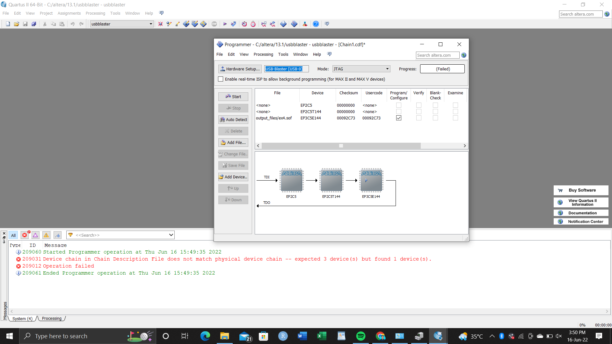

# Experiment-11-programming-logic-device-s-FPGA-BOARDS-
 ### AIM: 
 To understand the standard procedure to interface an FPGA board and flashing method using usb blaster 
### HARDWARE REQUIRED:  
– PC, Cyclone II , USB flasher
### SOFTWARE REQUIRED:  
 Quartus prime

# Procedure 

### STEP 1:
Start the Quartus II Programmer.

### STEP 2:
Click Add File and select the path to the desired .sof.

### STEP 3:
Turn on the Program/Configure option for the added file.

### STEP 4:
Click Start to download the selected file to the FPGA. Configuration is complete when the progress bar reaches 100%.

 

### RESULT
Thus we have understand the standard procedure to interface an FPGA board and flashing method using usb blaster.

